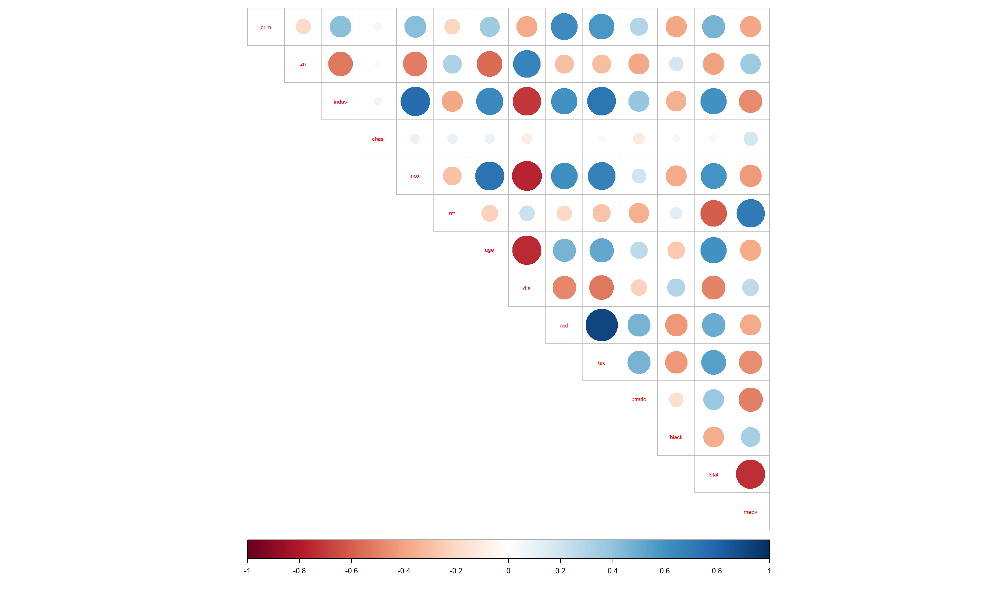

***

# Introduction to Open Data Science - Course Project


# Chapter 1: About the project

*Introduction to Open Data Science course, Autumn 2023*


##Link to my GitHub repository
<https://github.com/your_github_username/IODS-project)>


```r
# This is a so-called "R chunk" where you can write R code.

date()
```

```
## [1] "Tue Dec 12 02:30:38 2023"
```
## My experience

I heard about the course through my doctoral school's e-mail list, took a closer look at the contents of the course and found the course to be beneficial to my studies and current and future work.

I just finished watching the webinars and reading the recommended chapters for this week from R for Health Data Science and the MABS4IODS. I am excited to learn about GitHub and more about good practices in R and R Markdown, even though I have used R for a year already. My learning of R thus far has been task orientated and I realize that it is good to recap the basics. I especially want and expect to learn about GitHub, which I have not used before. 

## New things I learned

- I learned new things from the Excercise set 1. New packages or functions for me were:
  - lubridate (package) to handle dates
  - **bind_rows()** to add new rows to tibble from new tibble
  - **fct_relevel()** to change factor level order e.g. in
  - &rarr; mutate(income = **fct_relevel**(income, "Low", "Lower-Middle", "Upper-Middle", "High"))
  - **starts_with()** to use e.g. with select to get all columns that start with a certain string as in e.g.
  - &rarr; **select**(starts_with("deaths"))
  - **matches()** to use e.g. with pivot_longer to operate on columns that match a certain string, and can also take operators like AND (&) or OR (|) as in e.g.
  - &rarr; gbd_wide %>% pivot_longer(**matches**("Female**|**Male"), names_to = "sex_year", values_to = "deaths_millions")

- Something I knew, but rarely use automatically (without googleing) and hope to use more and more confidently for now on were operators or functions:
  - **%in%** (operator?) for e.g. in the following code
  - &rarr; filter(cause **%in%** c("Communicable diseases", "Non-communicable diseases")
  - **mutate()** to modify tibble for e.g. by adding columns, as in the following codes
  - &rarr; **mutate**(above_threshold = if_else(measurement > 3, "Above three", "Below three"))
  - &rarr; typesdata %>% **mutate**(plot_label = paste(id, "was last measured at", date, ", and the value was", measurement))
  - &rarr; pastedata %>% **mutate**(date = paste(day, month, year, sep = "-"))
- Although I use **group_by()** command often, it is good to recap
  - &rarr; gbd2017 %>% **group_by**(cause, sex) %>% summarise(deaths_per_group = sum(deaths_millions))


- I also realized, I use data frame more often than I use **tibble** and it might be good to change this

## Thoughts about plotting with ggplot2

- I didn't realize that it's possible to do *filtering inside ggplot*, as in:
  - &rarr; + facet_wrap(~pop **> 50000000**)
- Or *do transformations*, e.g. divide values by 1000 as in:
  - &rarr; ggplot(aes(x = gdpPercap**/1000**, y = lifeExp, colour = continent))
- I have not used the **size** argument in ggplot aes() before to form a *bubble plot* as in:
    - rarr; ggplot(aes(x = gdpPercap/1000, y = lifeExp, **size** = pop))
- Two things to remember from the following code:
  - 1) that I can use *fct_reorder()* to reorder according to e.g. value *within ggplot*, and 
  - 2) when to use color and fill *arguments within geom() rather than aes()*
  - &rarr; gapdata2007 %>% filter(continent == "Europe") %>% ggplot(aes(x = **fct_reorder**(country, lifeExp), y = lifeExp)) + geom_col(**color = "deepskyblue", fill = NA**) + coord_flip()
- I should start using more often the **Multiple geoms** property of ggplot for *overlapping ploting* as in e.g.
  - &rarr; geom_boxplot() + geom_jitter()
- And that I can have both *shared* aes() for the plottings as well as *separate* aes(), as in:
  - &rarr; gapdata2007 %>% ggplot(aes(**x** = continent, **y** = lifeExp)) + geom_boxplot() + geom_jitter(aes(**colour** = continent))


  
***
  

# Chapter 2: Linear regression


```r
date()
```

```
## [1] "Tue Dec 12 02:30:41 2023"
```

*This week we worked with linear regression. we learned how to do linear regression model with lm(), how to interpret the test statistics of linear model, and how to do graphical diagnostics for the data to be able to decide if the assumptions for linear regeression are met*

## The students2014 dataset

Data is **modified** results from an international survey of Approaches to Learning, that was collected between 3.12.2014 - 10.1.2015 by Kimmo Vehkalahti. **Original data** can be found from: http://www.helsinki.fi/~kvehkala/JYTmooc/JYTOPKYS3-data.txt

More information of the data can be found from here: https://www.mv.helsinki.fi/home/kvehkala/JYTmooc/JYTOPKYS3-meta.txt

The following **modifications** to the data was done by Laura Häkkinen on 07.11.2023: Zero values for variable "points" are NA and were removed from the data to include 166 observations, while the original data had 183 observations. Only variables "age", "points", and "gender" were taken from the original data without modificatios, while "attitude" is "Attitude" from the original data divided by 10 to scale as a mean value of ten questions, and "deep", "surf", and "stra" were calculated as **mean values** for multiple questions in these categories

The modified data here contains results for a set of questions which are classified to 3 categories:
- deep questions (**deep**)
- surface questions (**surf**)
- strategic questions (**stra**)

as well as:
- global attitude toward statistics (**attitude**)
- exam points (**points**)
- age of the person (in years) (**age**) derived from the date of birth
- gender of the person (**gender**) given as M (Male), F (Female)


```r
dataset <- read.csv2("\\\\ad.helsinki.fi\\home\\l\\lehakkin\\Desktop\\KURSSIT\\Open_Data_Science\\IODS-project\\data\\learning2014.csv")
str(dataset)
```

```
## 'data.frame':	166 obs. of  7 variables:
##  $ age     : int  53 55 49 53 49 38 50 37 37 42 ...
##  $ attitude: num  3.7 3.1 2.5 3.5 3.7 3.8 3.5 2.9 3.8 2.1 ...
##  $ points  : int  25 12 24 10 22 21 21 31 24 26 ...
##  $ gender  : chr  "F" "M" "F" "M" ...
##  $ deep    : num  3.58 2.92 3.5 3.5 3.67 ...
##  $ surf    : num  2.58 3.17 2.25 2.25 2.83 ...
##  $ stra    : num  3.38 2.75 3.62 3.12 3.62 ...
```

```r
# put gender as the first varialble
dataset <- dataset[, c(4,1,2,3,5,6,7)]
```

## Graphical overview of the dataset


```r
# access the GGally and ggplot2 libraries
library(GGally)
```

```
## Warning: package 'GGally' was built under R version 4.2.3
```

```
## Loading required package: ggplot2
```

```
## Warning: package 'ggplot2' was built under R version 4.2.3
```

```
## Registered S3 method overwritten by 'GGally':
##   method from   
##   +.gg   ggplot2
```

```r
library(ggplot2)

# create plot matrix with ggpairs()
p <- ggpairs(dataset, mapping = aes(col = gender), lower = list(combo = wrap("facethist", bins = 20)))

# draw the plot
p
```


### Distributions of the data 

Distributions look otherwise ok (close to normal)
except for:
- age, which is right skewed
- points, which seem to have 2-3 peaks
- deep for M seems to be a bit left skewed
- surf for M a bit right skewed

### Correlations
Significantly correlating variables are
- attitude and points: strong positive correlation for All (0.437), F, and M
- surf and attitude: negative correlation for All (-0.176), but only significant for M
- surf and deep: negative correlation for All (-0.324), but only significant for M, for which the correlation is strong (-0.622)
- surf and stra: negative correlation found when both genders included, but individually within F and M no significant correlation

### Other comments
- there are more females than to males
- age median value is ~20, but a bit higher for M
- attitude median values are higher for M
- there seems to be up to 3 peaks for points with values approx. at 10, 20 and 30
- surf and stra median values differ between M and F


## Regression model

We will make a regression model for the data so that "points" is the dependent variable. Since attitude had the highest correlations with exam points,  let's include it as an explanatory variables.

Stra *marginally* correlates with points, so let's add that as well

Surf *marginally* correlates with points, but it also correlates with stra (), which might be a problem


```r
m <- lm(points ~ attitude + stra + surf, data = dataset)
summary(m)
```

```
## 
## Call:
## lm(formula = points ~ attitude + stra + surf, data = dataset)
## 
## Residuals:
##      Min       1Q   Median       3Q      Max 
## -17.1550  -3.4346   0.5156   3.6401  10.8952 
## 
## Coefficients:
##             Estimate Std. Error t value Pr(>|t|)    
## (Intercept)  11.0171     3.6837   2.991  0.00322 ** 
## attitude      3.3952     0.5741   5.913 1.93e-08 ***
## stra          0.8531     0.5416   1.575  0.11716    
## surf         -0.5861     0.8014  -0.731  0.46563    
## ---
## Signif. codes:  0 '***' 0.001 '**' 0.01 '*' 0.05 '.' 0.1 ' ' 1
## 
## Residual standard error: 5.296 on 162 degrees of freedom
## Multiple R-squared:  0.2074,	Adjusted R-squared:  0.1927 
## F-statistic: 14.13 on 3 and 162 DF,  p-value: 3.156e-08
```

### Model 1 interpretation

The F-statistic for the whole model gives a significant p value (3.156e-08), meaning that there is strong evidence that not all three coefficients are zero, but the stra and surf explanatory variables do not have a statistically significant relationship with the target variable (points), so I will remove them and only leave attitude, which is highly significant with p values smaller than 0.001 (1.93e-08). The multiple R2 value, i.e. square of the multiple correlation coefficient, for the model is 0.2074 meaning that the model explains ~21% of the variation in the data.

### Running a new model


```r
m2 <- lm(points ~ attitude, data = dataset)
summary(m2)
```

```
## 
## Call:
## lm(formula = points ~ attitude, data = dataset)
## 
## Residuals:
##      Min       1Q   Median       3Q      Max 
## -16.9763  -3.2119   0.4339   4.1534  10.6645 
## 
## Coefficients:
##             Estimate Std. Error t value Pr(>|t|)    
## (Intercept)  11.6372     1.8303   6.358 1.95e-09 ***
## attitude      3.5255     0.5674   6.214 4.12e-09 ***
## ---
## Signif. codes:  0 '***' 0.001 '**' 0.01 '*' 0.05 '.' 0.1 ' ' 1
## 
## Residual standard error: 5.32 on 164 degrees of freedom
## Multiple R-squared:  0.1906,	Adjusted R-squared:  0.1856 
## F-statistic: 38.61 on 1 and 164 DF,  p-value: 4.119e-09
```

### Model 2 interpretation

Now only one explanatory variable, attitude, which is significant. The relationship between attitude and points is positive, meaning that a higher value in attitude gives a higher value in points. The estimate value 3.5255 means that the mean of points variable changes this much given a one-unit shift in the attitude value (while holding other variables in the model constant). Effect could be written as: points = 11.6372 + 3.5255**attitude

Model multiple R2 value is 0.1906 meaning that the model explains ~19% (or the variation in additude explains ~19%) of the variation in the points

The F-statistic for the whole model gives a significant p value (4.119e-09)

## Regression diagnostics

We will investigate the residuals for regression diagnostics. Residuals are the difference between an observed value of the response variable and the fitted value. Residuals essentially estimate the error terms in the model. Below we make 3 plots with the residuals: *Residuals vs Fitted values, Normal QQ-plot and Residuals vs Leverage*


```r
# make the model
m2 <- lm(points ~ attitude, data = dataset)

# draw simple scatter plot and diagnostic plots using the plot() function. Choose the plots 1, 2 and 5, which correspond to Residuals vs Fitted values, Normal QQ-plot and Residuals vs Leverage
# combine into one figure with par()
ggplot(dataset, aes(x = attitude, y = points)) + 
  geom_point() +
  stat_smooth(method = "lm")
```

```
## `geom_smooth()` using formula = 'y ~ x'
```


```r
par(mfrow = c(2,2))
plot(m2, which = c(1,2,5))
```


### Assumptions with linear regression are: 
- **Linear relationship** between predictors and outcome
- **Equal variance of residuals** or  **Homoscedasticity** or **constant variance** where the variance of residual is the same for any value of x
- **Normal distribution of residuals**
- **Independence of residuals** where observations are independent of each other


### Are assumptions met in our model?

#### Checking for linearity

According to the **simple scatter plot** the **relationship between x and y seem linear** (no other clear shape to the dots than a line)

#### Checking equal variance of residuals (and outliers)

In **residuals vs fitted values plot** the residuals are plotted against the fitted values of the response variable, and it can be used to detect unequal error variances. The distance of the observations from the fitted line should be the same on the left side as on the right side. Here, residuals are located randomly around the zero line (no "shape" to the residuals, but rather a "band of dots") indicating that the **constant variance assumption is met**, although looks like there is a bit less deviation from the zero line at the right side of the plot, but since variability in the residuals does not constantly change with the size of the fitted values, and the less variation with the higher fitted values can be due to fewer observations there, probably no need for a transformation of the response variable. From the plot we can also see there might be few *outliers*, that fall on the bottom of the plot. These are marked, 35, 56, and 145, indicating that these rows in our data might be outliers.

Also the **residuals vs leverage plot** can help detect outliers. We have some observations outside the Cook's distance in the residuals vs leverage plot (56, 35, and 71)


#### Checking for normality

**QQ-plot** can be used to detect normality. Based on the QQ-plot, there seems to be a systematic deviation from the normal distribution since a slight deviation from the line at both ends of the quantiles. This indicates that the data might be *skewed* a bit, this could be due to the outliers as well. **Removing of the outliers should be considered**. But, still most of the dots fall into the line, indicating that the normality assumption is probably met.

#### running a test for normality

I still want to run a test to check for normality, because interpreting the figures was a bit difficult. I use the function in below chunk that makes 4 tests for normality of the residuals. If p value is small it indicates non-normal distribution. I will use Kolmogorov-Smirnov p-value, because we have more than 50 observations (if less then I should use Shapiro test).


```r
library("olsrr")
```

```
## Warning: package 'olsrr' was built under R version 4.2.3
```

```
## 
## Attaching package: 'olsrr'
```

```
## The following object is masked from 'package:datasets':
## 
##     rivers
```

```r
ols_test_normality(m2)
```

```
## Warning in ks.test.default(y, "pnorm", mean(y), sd(y)): ties should not be
## present for the Kolmogorov-Smirnov test
```

```
## -----------------------------------------------
##        Test             Statistic       pvalue  
## -----------------------------------------------
## Shapiro-Wilk              0.9739         0.0032 
## Kolmogorov-Smirnov        0.0619         0.5479 
## Cramer-von Mises         11.4711         0.0000 
## Anderson-Darling          0.7013         0.0659 
## -----------------------------------------------
```
High p-value in Kolmogorov-Smirnov test (0.5479) indicates that the **residuals are normally distributed**.


#### Checking for independence

We do not use any plot to test for the independence, but rather deduce this from the experimental setup. Since this was not a longitudinal data and there is no other aspect of the setup to question the independence of the measurements, I will determine that the **independence of residuals assumption is met**.


***


# Chapter 3: logistic regression

## The data

The data contains student achievement in secondary education of two Portuguese schools. The data attributes include student grades, demographic, social and school related features, as well as the alcohol use data, and it was collected by using school reports and questionnaires. Two datasets are provided regarding the performance in two distinct subjects: Mathematics (mat) and Portuguese language (por).

More information of the original data from:
<https://www.archive.ics.uci.edu/dataset/320/student+performance>

### the modified data

The joined data set used in the analysis combines the two student alcohol consumption data sets. The following adjustments have been made:

- The variables not used for joining the two data have been combined by averaging (including the grade variables)
- 'alc_use' is the average of 'Dalc' and 'Walc'
- 'high_use' is TRUE if 'alc_use' is higher than 2 and FALSE otherwise

- more info of how the data was created from the original data in: <https://github.com/lehakkin/IODS-project/blob/master/data/create_learning2014.R>

### get the data


```r
setwd("\\\\ad.helsinki.fi\\home\\l\\lehakkin\\Desktop\\KURSSIT\\Open_Data_Science\\IODS-project\\data")

alc <- read.csv2(file = "alc.csv")

names(alc)
```

```
##  [1] "school"     "sex"        "age"        "address"    "famsize"   
##  [6] "Pstatus"    "Medu"       "Fedu"       "Mjob"       "Fjob"      
## [11] "reason"     "guardian"   "traveltime" "studytime"  "schoolsup" 
## [16] "famsup"     "activities" "nursery"    "higher"     "internet"  
## [21] "romantic"   "famrel"     "freetime"   "goout"      "Dalc"      
## [26] "Walc"       "health"     "failures"   "paid"       "absences"  
## [31] "G1"         "G2"         "G3"         "alc_use"    "high_use"
```


```r
# get the packages
# access the tidyverse libraries tidyr, dplyr, ggplot2
library(tidyr); library(dplyr); library(ggplot2)
```

```
## Warning: package 'tidyr' was built under R version 4.2.3
```

```
## Warning: package 'dplyr' was built under R version 4.2.3
```

```
## 
## Attaching package: 'dplyr'
```

```
## The following objects are masked from 'package:stats':
## 
##     filter, lag
```

```
## The following objects are masked from 'package:base':
## 
##     intersect, setdiff, setequal, union
```


## Hypothesis of alcohol consumption
I will model high/low alcohol usage with these 4 explanatoryvariables: 

- activities - extra-curricular activities (binary: yes or no)
- goout - going out with friends (numeric: from 1 - very low to 5 - very high)
- sex - student's sex (binary: 'F' - female or 'M' - male)
- age - student's age (numeric: from 15 to 22)

The hypothesis behind using these explanatory variables are:

- **age** affects alcohol usage because of the legal status to drink alcohol changes between the 15 and 22
- **going out** affects alcohol usage in cases where alcohol consumption is a social event
- **sex** affects alcohol usage, so that males typically consume more alcohol
- **activities** affect alcohol usage by limiting time for alcohol usage


## Data distribution and relationship


#### View of the data

##### Distributions


```r
model_var <- c("high_use", "sex", "age", "activities", "goout")

# use gather() to gather columns into key-value pairs and then glimpse() at the resulting data
alc %>% select(all_of(model_var)) %>% gather() %>% ggplot(aes(value)) + geom_bar() + facet_wrap("key", scales = "free")
```


- **Distributions** look ok (goout is normally distributed, activities and sex have similar counts for each group), otherwise than for *age* which is *right-skewed*

#### Numerical distributions


```r
# produce summary statistics by group
alc %>% group_by(sex) %>% summarise(count = n())
```

```
## # A tibble: 2 × 2
##   sex   count
##   <chr> <int>
## 1 F       195
## 2 M       175
```

```r
alc %>% group_by(age) %>% summarise(count = n())
```

```
## # A tibble: 7 × 2
##     age count
##   <int> <int>
## 1    15    81
## 2    16   102
## 3    17    97
## 4    18    77
## 5    19    11
## 6    20     1
## 7    22     1
```

```r
alc %>% group_by(activities) %>% summarise(count = n())
```

```
## # A tibble: 2 × 2
##   activities count
##   <chr>      <int>
## 1 no           179
## 2 yes          191
```

```r
alc %>% group_by(goout) %>% summarise(count = n())
```

```
## # A tibble: 5 × 2
##   goout count
##   <int> <int>
## 1     1    22
## 2     2    97
## 3     3   120
## 4     4    78
## 5     5    53
```

##### explanatory vs dependet


```r
library("ggpubr")
```

```
## Warning: package 'ggpubr' was built under R version 4.2.3
```

```r
table(alc$high_use, alc$activities, alc$sex)
```

```
## , ,  = F
## 
##        
##         no yes
##   FALSE 80  74
##   TRUE  24  17
## 
## , ,  = M
## 
##        
##         no yes
##   FALSE 40  65
##   TRUE  35  35
```

```r
# Box plots
g1 <- ggplot(alc, aes(x = age , y = high_use, col = sex)) + geom_boxplot()
g2 <- ggplot(alc, aes(x = goout, y = high_use, col = sex)) + geom_boxplot()


comb <- ggarrange(g1, g2,
                    ncol = 2, nrow = 2, common.legend = TRUE, legend="right")
comb
```


Looks like
- activities correlates weakly with high_use status overall, and the effect is somewhat different for male and female
- age and high_use status is opposite to male and female: the median age for female without high_use status is 17 and with high_use status 16, while for male it is the opposite
- goout seems to correlate highly with alc status in males

The original hypothesis was somewhat ok I want to include interaction of sex with age (I also tried with interaction with activities, but it wasn't significant)


## logistic regression


```r
# find the model with glm()
m <- glm(high_use ~ goout + age*sex + activities, data = alc, family = "binomial")

# print out a summary of the model
summary(m)
```

```
## 
## Call:
## glm(formula = high_use ~ goout + age * sex + activities, family = "binomial", 
##     data = alc)
## 
## Deviance Residuals: 
##     Min       1Q   Median       3Q      Max  
## -1.7538  -0.7875  -0.5279   0.8459   2.4646  
## 
## Coefficients:
##               Estimate Std. Error z value Pr(>|z|)    
## (Intercept)   -0.01392    2.89313  -0.005   0.9962    
## goout          0.76116    0.12180   6.249 4.12e-10 ***
## age           -0.21722    0.17504  -1.241   0.2146    
## sexM          -7.74537    3.74869  -2.066   0.0388 *  
## activitiesyes -0.47695    0.25805  -1.848   0.0646 .  
## age:sexM       0.52602    0.22557   2.332   0.0197 *  
## ---
## Signif. codes:  0 '***' 0.001 '**' 0.01 '*' 0.05 '.' 0.1 ' ' 1
## 
## (Dispersion parameter for binomial family taken to be 1)
## 
##     Null deviance: 452.04  on 369  degrees of freedom
## Residual deviance: 378.38  on 364  degrees of freedom
## AIC: 390.38
## 
## Number of Fisher Scoring iterations: 4
```

### Model interpretation

- The terms goout, activities and the interaction  of age and sex are significant or margibally significant (activities)
- It doesn't matter if age is not significant, because the interaction is sig


```r
library(finalfit)
```

```
## Warning: package 'finalfit' was built under R version 4.2.3
```

```r
dependent <- "high_use"
explanatory <-c("sex*age", "activities", "goout")
explanatory_multi <- c("sex",  "age", "activities", "goout")

alc %>% 
  finalfit(dependent, explanatory, explanatory_multi,
           keep_models = TRUE, metrics = TRUE)
```

```
## [[1]]
##  Dependent: high_use                  FALSE       TRUE
##                  sex           F 154 (79.0)  41 (21.0)
##                                M 105 (60.0)  70 (40.0)
##                  age   Mean (SD) 16.5 (1.2) 16.8 (1.2)
##           activities          no 120 (67.0)  59 (33.0)
##                              yes 139 (72.8)  52 (27.2)
##                goout   Mean (SD)  2.9 (1.0)  3.7 (1.1)
##             sexM:age Interaction       <NA>          -
##        Coefficient (univariable) Coefficient (multivariable full)
##                                -                                -
##  -1.63 (-2.91 to -0.34, p=0.013)  -1.50 (-2.71 to -0.30, p=0.015)
##   -0.02 (-0.08 to 0.04, p=0.537)   -0.04 (-0.09 to 0.02, p=0.171)
##                                -                                -
##   -0.06 (-0.15 to 0.04, p=0.230)   -0.08 (-0.17 to 0.00, p=0.064)
##     0.14 (0.11 to 0.18, p<0.001)     0.14 (0.10 to 0.18, p<0.001)
##     0.11 (0.03 to 0.19, p=0.005)     0.10 (0.03 to 0.17, p=0.006)
##     Coefficient (multivariable)
##                               -
##    0.18 (0.09 to 0.27, p<0.001)
##   0.02 (-0.02 to 0.05, p=0.349)
##                               -
##  -0.08 (-0.17 to 0.00, p=0.056)
##    0.14 (0.10 to 0.18, p<0.001)
##                               -
## 
## [[2]]
## [[2]][[1]]
## [1] "Number in dataframe = 370, Number in model = 370, Missing = 0, Log-likelihood = -197.6, AIC = 409.2, R-squared = 0.19, Adjusted R-squared = 0.18"
## 
## [[2]][[2]]
## [1] "Number in dataframe = 370, Number in model = 370, Missing = 0, Log-likelihood = -201.41, AIC = 414.8, R-squared = 0.17, Adjusted R-squared = 0.16"
```
Model comparison shows that it's better to keep tthe interaction term (AIC is smaller with interaction)


###  coefficients of the model as odds ratios


```r
# compute odds ratios (OR)
OR <- coef(m) %>% exp

# compute confidence intervals (CI)
CI <- confint(m)
```

```
## Waiting for profiling to be done...
```

```r
# print out the odds ratios with their confidence intervals
cbind(OR, CI)
```

```
##                         OR       2.5 %      97.5 %
## (Intercept)   0.9861756251  -5.6990954  5.69620254
## goout         2.1407643073   0.5287167  1.00733038
## age           0.8047493668  -0.5661788  0.12322461
## sexM          0.0004327424 -15.1785485 -0.44445449
## activitiesyes 0.6206737981  -0.9882426  0.02560661
## age:sexM      1.6921872131   0.0878742  0.97441656
```

## Model prediction


```r
# predict() the probability of high_use
probabilities <- predict(m, type = "response")

# add the predicted probabilities to 'alc'
alc <- mutate(alc, probability = probabilities)

# use the probabilities to make a prediction of high_use
alc <- mutate(alc, prediction = alc$probability>0.5)

# see the last ten original classes, predicted probabilities, and class predictions
select(alc, failures, absences, sex, high_use, probability, prediction) %>% tail(10)
```

```
##     failures absences sex high_use probability prediction
## 361        0        3   M    FALSE   0.3311049      FALSE
## 362        1        0   M    FALSE   0.4085869      FALSE
## 363        1        7   M     TRUE   0.5206271       TRUE
## 364        0        1   F    FALSE   0.1624010      FALSE
## 365        0        6   F    FALSE   0.1074151      FALSE
## 366        1        2   F    FALSE   0.0432805      FALSE
## 367        0        2   F    FALSE   0.2933211      FALSE
## 368        0        3   F    FALSE   0.0255871      FALSE
## 369        0        4   M     TRUE   0.7851751       TRUE
## 370        0        2   M     TRUE   0.1915809      FALSE
```

```r
# tabulate the target variable versus the predictions
table(high_use = alc$high_use, prediction = alc$prediction)
```

```
##         prediction
## high_use FALSE TRUE
##    FALSE   238   21
##    TRUE     63   48
```
### loss function


```r
# define a loss function (mean prediction error)
loss_func <- function(class, prob) {
  n_wrong <- abs(class - prob) > 0.5
  mean(n_wrong)
}

# call loss_func to compute the average number of wrong predictions in the (training) data
loss_func(class = alc$high_use, prob = alc$probability)
```

```
## [1] 0.227027
```

### Cross validation


```r
# compute the average number of wrong predictions in the (training) data


# K-fold cross-validation
library(boot)
cv <- cv.glm(data = alc, cost = loss_func, glmfit = m, K = nrow(alc))

# average number of wrong predictions in the cross validation
cv$delta[1]
```

```
## [1] 0.227027
```


***


# Chapter 4

## load packages


```r
library(tidyr)
library("MASS")
```

```
## 
## Attaching package: 'MASS'
```

```
## The following object is masked from 'package:dplyr':
## 
##     select
```

```
## The following object is masked from 'package:olsrr':
## 
##     cement
```

```r
library("corrplot")
```

```
## Warning: package 'corrplot' was built under R version 4.2.3
```

```
## corrplot 0.92 loaded
```

```r
library(GGally)
library(ggplot2)
library(corrplot)
```


## load data

### link to data: https://stat.ethz.ch/R-manual/R-devel/library/MASS/html/Boston.html

### Source for the data

- Harrison, D. and Rubinfeld, D.L. (1978) Hedonic prices and the demand for clean air. J. Environ. Economics and Management 5, 81–102.
- Belsley D.A., Kuh, E. and Welsch, R.E. (1980) Regression Diagnostics. Identifying Influential Data and Sources of Collinearity. New York: Wiley.


```r
Boston <- Boston
```

### Explanation of the variables

- crim: per capita crime rate by town.
- zn: proportion of residential land zoned for lots over 25,000 sq.ft.
- indus: proportion of non-retail business acres per town.
- chas: Charles River dummy variable (= 1 if tract bounds river; 0 otherwise).
- nox: nitrogen oxides concentration (parts per 10 million).
- rm: average number of rooms per dwelling.
- age: proportion of owner-occupied units built prior to 1940.
- dis:weighted mean of distances to five Boston employment centres.
- rad: index of accessibility to radial highways.
- tax: full-value property-tax rate per $10,000.
- ptratio: pupil-teacher ratio by town.
- black: 1000(Bk - 0.63)^2, where Bk is the proportion of blacks by town.
- lstat: lower status of the population (percent).
- medv: median value of owner-occupied homes in $1000s.

## structure and dimensions of the data


```r
str(Boston)
```

```
## 'data.frame':	506 obs. of  14 variables:
##  $ crim   : num  0.00632 0.02731 0.02729 0.03237 0.06905 ...
##  $ zn     : num  18 0 0 0 0 0 12.5 12.5 12.5 12.5 ...
##  $ indus  : num  2.31 7.07 7.07 2.18 2.18 2.18 7.87 7.87 7.87 7.87 ...
##  $ chas   : int  0 0 0 0 0 0 0 0 0 0 ...
##  $ nox    : num  0.538 0.469 0.469 0.458 0.458 0.458 0.524 0.524 0.524 0.524 ...
##  $ rm     : num  6.58 6.42 7.18 7 7.15 ...
##  $ age    : num  65.2 78.9 61.1 45.8 54.2 58.7 66.6 96.1 100 85.9 ...
##  $ dis    : num  4.09 4.97 4.97 6.06 6.06 ...
##  $ rad    : int  1 2 2 3 3 3 5 5 5 5 ...
##  $ tax    : num  296 242 242 222 222 222 311 311 311 311 ...
##  $ ptratio: num  15.3 17.8 17.8 18.7 18.7 18.7 15.2 15.2 15.2 15.2 ...
##  $ black  : num  397 397 393 395 397 ...
##  $ lstat  : num  4.98 9.14 4.03 2.94 5.33 ...
##  $ medv   : num  24 21.6 34.7 33.4 36.2 28.7 22.9 27.1 16.5 18.9 ...
```

```r
dim(Boston)
```

```
## [1] 506  14
```

```r
names(Boston)
```

```
##  [1] "crim"    "zn"      "indus"   "chas"    "nox"     "rm"      "age"    
##  [8] "dis"     "rad"     "tax"     "ptratio" "black"   "lstat"   "medv"
```

```r
# check for NAs: number of NAs per column
colSums(is.na(Boston))
```

```
##    crim      zn   indus    chas     nox      rm     age     dis     rad     tax 
##       0       0       0       0       0       0       0       0       0       0 
## ptratio   black   lstat    medv 
##       0       0       0       0
```

```r
# summary of the data set
summary(Boston)
```

```
##       crim                zn             indus            chas        
##  Min.   : 0.00632   Min.   :  0.00   Min.   : 0.46   Min.   :0.00000  
##  1st Qu.: 0.08205   1st Qu.:  0.00   1st Qu.: 5.19   1st Qu.:0.00000  
##  Median : 0.25651   Median :  0.00   Median : 9.69   Median :0.00000  
##  Mean   : 3.61352   Mean   : 11.36   Mean   :11.14   Mean   :0.06917  
##  3rd Qu.: 3.67708   3rd Qu.: 12.50   3rd Qu.:18.10   3rd Qu.:0.00000  
##  Max.   :88.97620   Max.   :100.00   Max.   :27.74   Max.   :1.00000  
##       nox               rm             age              dis        
##  Min.   :0.3850   Min.   :3.561   Min.   :  2.90   Min.   : 1.130  
##  1st Qu.:0.4490   1st Qu.:5.886   1st Qu.: 45.02   1st Qu.: 2.100  
##  Median :0.5380   Median :6.208   Median : 77.50   Median : 3.207  
##  Mean   :0.5547   Mean   :6.285   Mean   : 68.57   Mean   : 3.795  
##  3rd Qu.:0.6240   3rd Qu.:6.623   3rd Qu.: 94.08   3rd Qu.: 5.188  
##  Max.   :0.8710   Max.   :8.780   Max.   :100.00   Max.   :12.127  
##       rad              tax           ptratio          black       
##  Min.   : 1.000   Min.   :187.0   Min.   :12.60   Min.   :  0.32  
##  1st Qu.: 4.000   1st Qu.:279.0   1st Qu.:17.40   1st Qu.:375.38  
##  Median : 5.000   Median :330.0   Median :19.05   Median :391.44  
##  Mean   : 9.549   Mean   :408.2   Mean   :18.46   Mean   :356.67  
##  3rd Qu.:24.000   3rd Qu.:666.0   3rd Qu.:20.20   3rd Qu.:396.23  
##  Max.   :24.000   Max.   :711.0   Max.   :22.00   Max.   :396.90  
##      lstat            medv      
##  Min.   : 1.73   Min.   : 5.00  
##  1st Qu.: 6.95   1st Qu.:17.02  
##  Median :11.36   Median :21.20  
##  Mean   :12.65   Mean   :22.53  
##  3rd Qu.:16.95   3rd Qu.:25.00  
##  Max.   :37.97   Max.   :50.00
```

Description

- **NO NAs** in the data
- All variables are numerical (num or integer). The ineteger vriables are chas and rad
- 14 variabes
- chas is dummy variable with two levels (0, 1)


## graphical overview of the data


```r
# plot matrix of the variables

# this should make the plot bigger in the output(?)
knitr::opts_chunk$set(fig.width=unit(18,"cm"), fig.height=unit(11,"cm"))

p <- ggpairs(Boston)
print(p, progress = F)
```

```
## Warning in ggmatrix_gtable(x, ...): Please use the 'progress' parameter in your
## ggmatrix-like function call.  See ?ggmatrix_progress for a few examples.
## ggmatrix_gtable 'progress' and 'progress_format' will soon be deprecated.TRUE
```


Commenting on the distributions of the variables and the relationships between them

- most variables are not normally distributed, but rather are skewed or have two peaks. Propably some standardization needed
- there are some strong correlation (non-linear) between the variables (e.g. dis and nox: -0.77; medv and istat: -0.74)

Since there are so many variable, lets look at the relationship with another method: Correlations plot


## Correlations plot


```r
# calculate the pearson correlation matrix and round it
cor_matrix <- cor(Boston, method = "pearson") 

# visualize the correlation matrix, but use only two digits
cor_matrix %>% round(digits = 2) %>% corrplot(method="circle", type = "upper", cl.pos = "b", tl.pos = "d", tl.cex = 0.6)
```



Note! The areas of circles show the absolute value of corresponding correlation coefficients, while the color intensity shows the correlation coefficient (not absolute) so that negative correlations are blue and positive red

Strong **positive correlations** with

- medv and istat
- age and dis
- dis and nox
- dis and indus

Strong **negative correlaions** with

- tax and rad
- age and nox
- nox and indus
- tax and indus
- tax and nox
- medv and rm
- dis and zn


## Standardization of the data


We are going to standardize the data by scaling the whole data set (can be done, because all numerical variables)

In the scaling we subtract the column means from the corresponding columns and divide the difference with standard deviation.

$$scaled(x) = \frac{x - mean(x)}{ sd(x)}$$


```r
# center and standardize variables
boston_scaled <- scale(Boston)

# summaries of the scaled variables
summary(boston_scaled)
```

```
##       crim                 zn               indus              chas        
##  Min.   :-0.419367   Min.   :-0.48724   Min.   :-1.5563   Min.   :-0.2723  
##  1st Qu.:-0.410563   1st Qu.:-0.48724   1st Qu.:-0.8668   1st Qu.:-0.2723  
##  Median :-0.390280   Median :-0.48724   Median :-0.2109   Median :-0.2723  
##  Mean   : 0.000000   Mean   : 0.00000   Mean   : 0.0000   Mean   : 0.0000  
##  3rd Qu.: 0.007389   3rd Qu.: 0.04872   3rd Qu.: 1.0150   3rd Qu.:-0.2723  
##  Max.   : 9.924110   Max.   : 3.80047   Max.   : 2.4202   Max.   : 3.6648  
##       nox                rm               age               dis         
##  Min.   :-1.4644   Min.   :-3.8764   Min.   :-2.3331   Min.   :-1.2658  
##  1st Qu.:-0.9121   1st Qu.:-0.5681   1st Qu.:-0.8366   1st Qu.:-0.8049  
##  Median :-0.1441   Median :-0.1084   Median : 0.3171   Median :-0.2790  
##  Mean   : 0.0000   Mean   : 0.0000   Mean   : 0.0000   Mean   : 0.0000  
##  3rd Qu.: 0.5981   3rd Qu.: 0.4823   3rd Qu.: 0.9059   3rd Qu.: 0.6617  
##  Max.   : 2.7296   Max.   : 3.5515   Max.   : 1.1164   Max.   : 3.9566  
##       rad               tax             ptratio            black        
##  Min.   :-0.9819   Min.   :-1.3127   Min.   :-2.7047   Min.   :-3.9033  
##  1st Qu.:-0.6373   1st Qu.:-0.7668   1st Qu.:-0.4876   1st Qu.: 0.2049  
##  Median :-0.5225   Median :-0.4642   Median : 0.2746   Median : 0.3808  
##  Mean   : 0.0000   Mean   : 0.0000   Mean   : 0.0000   Mean   : 0.0000  
##  3rd Qu.: 1.6596   3rd Qu.: 1.5294   3rd Qu.: 0.8058   3rd Qu.: 0.4332  
##  Max.   : 1.6596   Max.   : 1.7964   Max.   : 1.6372   Max.   : 0.4406  
##      lstat              medv        
##  Min.   :-1.5296   Min.   :-1.9063  
##  1st Qu.:-0.7986   1st Qu.:-0.5989  
##  Median :-0.1811   Median :-0.1449  
##  Mean   : 0.0000   Mean   : 0.0000  
##  3rd Qu.: 0.6024   3rd Qu.: 0.2683  
##  Max.   : 3.5453   Max.   : 2.9865
```

```r
# change the object to data frame
boston_scaled <- as.data.frame(boston_scaled)
class(boston_scaled)
```

```
## [1] "data.frame"
```

After scaling

- all means at zero
- smaller range (Min - Max)
- for example, before scaling crime had values from 0.006 to 88.976


### Create a categorical variable from the crime rate

Let's use the scaled crime rate to create the categorical variable by using the quantiles as the break points. Drop the old crime rate variable from the dataset.


```r
# create a quantile vector of crim and print it
bins <- quantile(boston_scaled$crim)
bins
```

```
##           0%          25%          50%          75%         100% 
## -0.419366929 -0.410563278 -0.390280295  0.007389247  9.924109610
```

```r
# create a categorical variable 'crime' by using the bins, and let's rename the categories
crime <- cut(boston_scaled$crim, breaks = bins, include.lowest = TRUE, labels = c("low", "med_low", "med_high", "high"))

# look at the table of the new factor crime
table(crime)
```

```
## crime
##      low  med_low med_high     high 
##      127      126      126      127
```

```r
# remove original crim from the dataset
boston_scaled <- dplyr::select(boston_scaled, -crim)

# add the new categorical value to scaled data
boston_scaled <- data.frame(boston_scaled, crime)
```


### Divide dataset to training and test set for model validation

Let's divide the dataset to train and test sets, so that 80% of the data belongs to the train set. 


```r
# number of rows in the Boston dataset 
n <- nrow(boston_scaled)

# choose randomly 80% of the rows
ind <- sample(n,  size = n * 0.8)

# create train set
train <- boston_scaled[ind,]

# create test set 
test <- boston_scaled[-ind,]
```


## Linear Discriminant Analysis (LDA)

Let's fit the linear discriminant analysis on the train set, by using the categorical crime rate as the target variable and all the other variables in the dataset as predictor variables, and draw the LDA (bi)plot.


```r
# linear discriminant analysis
lda.fit <- lda(crime ~ ., data = train)

# print the lda.fit object
lda.fit
```

```
## Call:
## lda(crime ~ ., data = train)
## 
## Prior probabilities of groups:
##       low   med_low  med_high      high 
## 0.2623762 0.2524752 0.2301980 0.2549505 
## 
## Group means:
##                   zn       indus         chas        nox         rm        age
## low       1.08970808 -0.94884625 -0.086616792 -0.9015506  0.4495289 -0.8977338
## med_low  -0.08999613 -0.35325374 -0.002135914 -0.5857255 -0.1103397 -0.3239221
## med_high -0.38488831  0.07043681  0.235683866  0.2535450  0.1451256  0.3705088
## high     -0.48724019  1.01708911 -0.042983423  1.0552146 -0.4156491  0.8263230
##                 dis        rad        tax     ptratio      black       lstat
## low       0.9448862 -0.6893371 -0.7452666 -0.41739933  0.3790148 -0.77779608
## med_low   0.4040617 -0.5506331 -0.5397188 -0.03878387  0.3275165 -0.17096987
## med_high -0.3403182 -0.4162821 -0.3428654 -0.22928698  0.1199263 -0.06410734
## high     -0.8490496  1.6384176  1.5142626  0.78111358 -0.7674285  0.85275251
##                medv
## low       0.5454163
## med_low   0.0207373
## med_high  0.2071117
## high     -0.6583742
## 
## Coefficients of linear discriminants:
##                 LD1          LD2         LD3
## zn       0.11880692  0.846588617 -0.84760467
## indus    0.08262853 -0.259581772  0.37430483
## chas    -0.10787078 -0.065423751  0.06856374
## nox      0.44658547 -0.502438535 -1.53123740
## rm      -0.13817879 -0.083502034 -0.21579827
## age      0.14965785 -0.294684529 -0.14035881
## dis     -0.09899140 -0.232046482  0.24921478
## rad      3.30035884  1.144273648  0.33507195
## tax      0.07965207 -0.294780651  0.28727603
## ptratio  0.10001196  0.126901790 -0.26592244
## black   -0.12091935 -0.002056225  0.12133722
## lstat    0.28103371 -0.222636436  0.23977107
## medv     0.26097132 -0.261550590 -0.30180952
## 
## Proportion of trace:
##    LD1    LD2    LD3 
## 0.9561 0.0328 0.0112
```

```r
# the function for lda biplot arrows
lda.arrows <- function(x, myscale = 1, arrow_heads = 0.1, color = "red", tex = 0.75, choices = c(1,2)){
  heads <- coef(x)
  graphics::arrows(x0 = 0, y0 = 0, 
         x1 = myscale * heads[,choices[1]], 
         y1 = myscale * heads[,choices[2]], col=color, length = arrow_heads)
  text(myscale * heads[,choices], labels = row.names(heads), 
       cex = tex, col=color, pos=3)
}

# target classes as numeric (needed in the next step)
classes <- as.numeric(train$crime)

# plot the lda results (select both lines and execute them at the same time!)
plot(lda.fit, dimen = 2, col = classes, pch = classes)
lda.arrows(lda.fit, myscale = 2.5)
```


```r
# let's plot again with higher myscale number to better see the smaller arrows
plot(lda.fit, dimen = 2, col = classes, pch = classes)
lda.arrows(lda.fit, myscale = 6)
```


```r
# and again
plot(lda.fit, dimen = 2, col = classes, pch = classes)
lda.arrows(lda.fit, myscale = 10)
```


High crime clearly separates into its own cluster with only some medium high crime overlapping

High crime seems to coincide clearly with **rad** (index of accessibility to radial highways) and somewhat with **ptratio** (pupil-teacher ratio by town)

Only some of the medium high crime separates into it's own cluster, while others overlap with medium low (and some with high). This separate medium high cluster coincides with nox, medv, stat, dis and indus


## Predict LDA

Let's save the crime categories from the test set, remove the categorical crime variable from the test dataset, and predict the classes with the LDA model on the test data. Then, let's cross tabulate the results with the crime categories from the test set.  


```r
# save the correct classes from test data
correct_classes <- test$crime

# remove the crime variable from test data
test <- dplyr::select(test, -crime)

# predict classes with test data
lda.pred <- predict(lda.fit, newdata = test)

# cross tabulate the results
table(correct = correct_classes, predicted = lda.pred$class)
```

```
##           predicted
## correct    low med_low med_high high
##   low       10      10        1    0
##   med_low    4      12        8    0
##   med_high   0       8       23    2
##   high       0       0        0   24
```

Comments on the lda prediction results:

- high crime was best predicted, so that all 24 incidences were predicted correctly (100 % correct)
- medium high crime was predicted the second best with 3 out of 22 incidences predicted incorrectly (86 % correct) 
- low crime was predicted the third best with 8 out of 19 incidences predicted incorrectly (58 % correct)
- medium low crime was predicted the worst with 19 out of 36 incidences were predicted correctly (47 % correct)


## Distance measures

Let's reload the Boston dataset and standardize it by scaling to get comparable distances. Then, let's calculate the euclidian and manhattan distances between the observations.


```r
data("Boston")

boston_scaled <- scale(Boston)

# euclidean distance matrix
dist_eu <- dist(boston_scaled)

# look at the summary of the distances
summary(dist_eu)
```

```
##    Min. 1st Qu.  Median    Mean 3rd Qu.    Max. 
##  0.1343  3.4625  4.8241  4.9111  6.1863 14.3970
```

```r
# manhattan distance matrix
dist_man <- dist(boston_scaled, method = "manhattan")

# look at the summary of the distances
summary(dist_man)
```

```
##    Min. 1st Qu.  Median    Mean 3rd Qu.    Max. 
##  0.2662  8.4832 12.6090 13.5488 17.7568 48.8618
```

## K-means


Let's run k-means algorithm on the scaled dataset with 3 clusters, and visualize the clusters.


```r
# k-means clustering
km <- kmeans(boston_scaled, centers = 3)

# plot the with clusters
pairs(boston_scaled, col = km$cluster)
```


Looks like, with three clusters, the variables best separating the cluster are:

- medv
- dis
- indus
- nox
- rad and tax (separate one of the clusters)


### K-means: determine the k

Before we run the final k-means algorithm, let's investigate what is the optimal number of clusters by calculating the total within sum of squares (**twcss**), and check at what cluster number there is the most drastic drop in twcss (shoulder effect in the plot). 


```r
set.seed(123)

# determine the number of clusters
k_max <- 10

# calculate the total within sum of squares
twcss <- sapply(1:k_max, function(k){kmeans(boston_scaled, k)$tot.withinss})

# visualize the results
qplot(x = 1:k_max, y = twcss, geom = 'line')
```

```
## Warning: `qplot()` was deprecated in ggplot2 3.4.0.
## This warning is displayed once every 8 hours.
## Call `lifecycle::last_lifecycle_warnings()` to see where this warning was
## generated.
```


The figure indicates that at k=2 there is the biggest drop in twcss (a shoulder effect)


### K-means clustering

Let's run the k-means algorithm again with the selected value for k=2. 


```r
# k-means clustering
km <- kmeans(boston_scaled, centers = 2)

# plot the Boston dataset with clusters
pairs(boston_scaled, col = km$cluster)
```


With two clusters, the variables best separating the cluster are:

- indus
- nox
- rad
- tax
- zn

Indus is probably best individual variable that separates the clusters clearly into the same clusters as the k-clusters, followed by nox. Together nox and rm also separate cluters very well.


***


# Capter 5: 5: Dimensionality reduction techniques

## Data

The 'human' dataset originates from the United Nations Development Programme. See their data page for more information.
<https://hdr.undp.org/data-center/human-development-index#/indicies/HDI>

For a nice overview see also the calculating the human development indices pdf:
<https://hdr.undp.org/system/files/documents/technical-notes-calculating-human-development-indices.pdf>

Most of the variable names in the data have been shortened and two new variables have been computed. See the meta file for the modified data here for descriptions of the variables:
<https://github.com/KimmoVehkalahti/Helsinki-Open-Data-Science/blob/master/datasets/human_meta.txt>


The data combines several indicators from most countries in the world

"Country" = Country name

**Health and knowledge**

"GNI" = Gross National Income per capita
"Life.Exp" = Life expectancy at birth
"Edu.Exp" = Expected years of schooling 
"Mat.Mor" = Maternal mortality ratio
"Ado.Birth" = Adolescent birth rate

**Empowerment**

"Parli.F" = Percetange of female representatives in parliament
"Edu2.F" = Proportion of females with at least secondary education
"Edu2.M" = Proportion of males with at least secondary education
"Labo.F" = Proportion of females in the labour force
"Labo.M" " Proportion of males in the labour force

"Edu2.FM" = Edu2.F / Edu2.M
"Labo.FM" = Labo2.F / Labo2.M


### Load data and packages


```r
library(readr)
```

```
## Warning: package 'readr' was built under R version 4.2.3
```

```r
library("FactoMineR")
```

```
## Warning: package 'FactoMineR' was built under R version 4.2.3
```

```r
library(dplyr)
library(tidyr)
library(tibble)
```

```
## Warning: package 'tibble' was built under R version 4.2.3
```

```r
library(GGally)
library(corrplot)
library(ggplot2)
```


```r
setwd("\\\\ad.helsinki.fi\\home\\l\\lehakkin\\Desktop\\KURSSIT\\Open_Data_Science\\IODS-project\\data")
human <- read_csv2(file = "human.csv")
```

```
## ℹ Using "','" as decimal and "'.'" as grouping mark. Use `read_delim()` for more control.
```

```
## Rows: 155 Columns: 9
## ── Column specification ────────────────────────────────────────────────────────
## Delimiter: ";"
## chr (1): Country
## dbl (8): Edu2.FM, Labo.FM, Edu.Exp, Life.Exp, GNI, Mat.Mor, Ado.Birth, Parli.F
## 
## ℹ Use `spec()` to retrieve the full column specification for this data.
## ℹ Specify the column types or set `show_col_types = FALSE` to quiet this message.
```


### Move the country names to rownames


```r
human <- column_to_rownames(human, "Country")
```


## graphical overview of the data


```r
# visualize the 'human_' variables
ggpairs(human, progress = FALSE)
```


```r
# compute the correlation matrix and visualize it with corrplot
corrplot(cor(human))
```


Some of the variable are **skewed**

Strong **positive correlation** with e.g. Life.Exp and Edu.Exp, Ado.Birth and Mat.mor
Strong **negative correlation** with e.g. Mat.Mor and Life.Exp, Life.Exp and Ado.Birth


## summaries of the variables in the data


```r
summary(human)
```

```
##     Edu2.FM          Labo.FM          Edu.Exp         Life.Exp    
##  Min.   :0.1717   Min.   :0.1857   Min.   : 5.40   Min.   :49.00  
##  1st Qu.:0.7264   1st Qu.:0.5984   1st Qu.:11.25   1st Qu.:66.30  
##  Median :0.9375   Median :0.7535   Median :13.50   Median :74.20  
##  Mean   :0.8529   Mean   :0.7074   Mean   :13.18   Mean   :71.65  
##  3rd Qu.:0.9968   3rd Qu.:0.8535   3rd Qu.:15.20   3rd Qu.:77.25  
##  Max.   :1.4967   Max.   :1.0380   Max.   :20.20   Max.   :83.50  
##       GNI            Mat.Mor         Ado.Birth         Parli.F     
##  Min.   :   581   Min.   :   1.0   Min.   :  0.60   Min.   : 0.00  
##  1st Qu.:  4198   1st Qu.:  11.5   1st Qu.: 12.65   1st Qu.:12.40  
##  Median : 12040   Median :  49.0   Median : 33.60   Median :19.30  
##  Mean   : 17628   Mean   : 149.1   Mean   : 47.16   Mean   :20.91  
##  3rd Qu.: 24512   3rd Qu.: 190.0   3rd Qu.: 71.95   3rd Qu.:27.95  
##  Max.   :123124   Max.   :1100.0   Max.   :204.80   Max.   :57.50
```

There is a big difference in the variances among the variables. 

**Data needs scaling**

But let's first do PCA with non-standardized human data


## Principal component analysis (PCA) 


```r
# perform principal component analysis (with the SVD method) for non-standardized human
pca_human <- prcomp(human)

#variability captured by the principal components
s <- summary(pca_human)
s
```

```
## Importance of components:
##                              PC1      PC2   PC3   PC4   PC5   PC6    PC7    PC8
## Standard deviation     1.854e+04 185.5219 25.19 11.45 3.766 1.566 0.1912 0.1591
## Proportion of Variance 9.999e-01   0.0001  0.00  0.00 0.000 0.000 0.0000 0.0000
## Cumulative Proportion  9.999e-01   1.0000  1.00  1.00 1.000 1.000 1.0000 1.0000
```

```r
# rounded percentanges of variance captured by each PC
pca_pr <- round(1*s$importance[2, ]*100, digits = 2)

# print out the percentages of variance
pca_pr
```

```
##   PC1   PC2   PC3   PC4   PC5   PC6   PC7   PC8 
## 99.99  0.01  0.00  0.00  0.00  0.00  0.00  0.00
```

```r
# create object pc_lab to be used as axis labels
pc_lab <- paste0(names(pca_pr), " (", pca_pr, "%)")

# biplot displaying the observations by the first two principal components
biplot(pca_human, choices = 1:2, cex = c(0.8, 1), col = c("grey40", "deeppink2"), xlab = pc_lab[1], ylab = pc_lab[2])
```

```
## Warning in arrows(0, 0, y[, 1L] * 0.8, y[, 2L] * 0.8, col = col[2L], length =
## arrow.len): zero-length arrow is of indeterminate angle and so skipped

## Warning in arrows(0, 0, y[, 1L] * 0.8, y[, 2L] * 0.8, col = col[2L], length =
## arrow.len): zero-length arrow is of indeterminate angle and so skipped

## Warning in arrows(0, 0, y[, 1L] * 0.8, y[, 2L] * 0.8, col = col[2L], length =
## arrow.len): zero-length arrow is of indeterminate angle and so skipped

## Warning in arrows(0, 0, y[, 1L] * 0.8, y[, 2L] * 0.8, col = col[2L], length =
## arrow.len): zero-length arrow is of indeterminate angle and so skipped
```


Looks really bad, because most of the variance is explained by the first component

## Standardize variables and repeat PCA


```r
# standardize the variables
human_std <- scale(human)

# print out summaries of the standardized variables
summary(human_std)
```

```
##     Edu2.FM           Labo.FM           Edu.Exp           Life.Exp      
##  Min.   :-2.8189   Min.   :-2.6247   Min.   :-2.7378   Min.   :-2.7188  
##  1st Qu.:-0.5233   1st Qu.:-0.5484   1st Qu.:-0.6782   1st Qu.:-0.6425  
##  Median : 0.3503   Median : 0.2316   Median : 0.1140   Median : 0.3056  
##  Mean   : 0.0000   Mean   : 0.0000   Mean   : 0.0000   Mean   : 0.0000  
##  3rd Qu.: 0.5958   3rd Qu.: 0.7350   3rd Qu.: 0.7126   3rd Qu.: 0.6717  
##  Max.   : 2.6646   Max.   : 1.6632   Max.   : 2.4730   Max.   : 1.4218  
##       GNI             Mat.Mor          Ado.Birth          Parli.F       
##  Min.   :-0.9193   Min.   :-0.6992   Min.   :-1.1325   Min.   :-1.8203  
##  1st Qu.:-0.7243   1st Qu.:-0.6496   1st Qu.:-0.8394   1st Qu.:-0.7409  
##  Median :-0.3013   Median :-0.4726   Median :-0.3298   Median :-0.1403  
##  Mean   : 0.0000   Mean   : 0.0000   Mean   : 0.0000   Mean   : 0.0000  
##  3rd Qu.: 0.3712   3rd Qu.: 0.1932   3rd Qu.: 0.6030   3rd Qu.: 0.6127  
##  Max.   : 5.6890   Max.   : 4.4899   Max.   : 3.8344   Max.   : 3.1850
```

```r
# perform principal component analysis (with the SVD method)
pca_human <- prcomp(human_std)

#variability captured by the principal components
s <- summary(pca_human)
s
```

```
## Importance of components:
##                           PC1    PC2     PC3     PC4     PC5     PC6     PC7
## Standard deviation     2.0708 1.1397 0.87505 0.77886 0.66196 0.53631 0.45900
## Proportion of Variance 0.5361 0.1624 0.09571 0.07583 0.05477 0.03595 0.02634
## Cumulative Proportion  0.5361 0.6984 0.79413 0.86996 0.92473 0.96069 0.98702
##                            PC8
## Standard deviation     0.32224
## Proportion of Variance 0.01298
## Cumulative Proportion  1.00000
```

```r
# rounded percentanges of variance captured by each PC
pca_pr <- round(1*s$importance[2, ]*100, digits = 1)

# print out the percentages of variance
pca_pr
```

```
##  PC1  PC2  PC3  PC4  PC5  PC6  PC7  PC8 
## 53.6 16.2  9.6  7.6  5.5  3.6  2.6  1.3
```

```r
# create object pc_lab to be used as axis labels
pc_lab <- paste0(names(pca_pr), " (", pca_pr, "%)")

# biplot displaying the observations by the first two principal components
biplot(pca_human, choices = 1:2, cex = c(0.8, 1), col = c("grey40", "deeppink2"), xlab = pc_lab[1], ylab = pc_lab[2])
```


**without standardizing** the PCA looks bad, because most of the variance is explained by the first component (almost 99.99%), which itself is mainly composed of the variation with the variable GNI, which has by far the largest range and variation in among the variables

**with standardization** PCA looks better and better represents the variation in all of the variables. Now the two first principal components together explain ~70% of the variation.

Countries are separated along the first component by *mainly* **Health and Knowledge**:
- Mat.Mor
- Ado.Birth
- Edu.Exp
- Edu2.FM
- GNI
- Life.Exp

...so that Mat.Mor and Ado.Birth are "draw" countries to the same direction, and the rest to the other direction. This makes sense, becauese we saw it earlier that Mat.Mor and Ado.Birth are positively correlated

Countries are separated along the second component by **Empowerment** excluding the Edu2.FM:
-Parli.F
-Labo.FM


## Load the Tea dataset


```r
tea <- read.csv("https://raw.githubusercontent.com/KimmoVehkalahti/Helsinki-Open-Data-Science/master/datasets/tea.csv", stringsAsFactors = TRUE)
```


### convert character variables to factors:

Everything seems to already be a factor or a inetger, so no conversion


```r
str(tea)
```

```
## 'data.frame':	300 obs. of  36 variables:
##  $ breakfast       : Factor w/ 2 levels "breakfast","Not.breakfast": 1 1 2 2 1 2 1 2 1 1 ...
##  $ tea.time        : Factor w/ 2 levels "Not.tea time",..: 1 1 2 1 1 1 2 2 2 1 ...
##  $ evening         : Factor w/ 2 levels "evening","Not.evening": 2 2 1 2 1 2 2 1 2 1 ...
##  $ lunch           : Factor w/ 2 levels "lunch","Not.lunch": 2 2 2 2 2 2 2 2 2 2 ...
##  $ dinner          : Factor w/ 2 levels "dinner","Not.dinner": 2 2 1 1 2 1 2 2 2 2 ...
##  $ always          : Factor w/ 2 levels "always","Not.always": 2 2 2 2 1 2 2 2 2 2 ...
##  $ home            : Factor w/ 2 levels "home","Not.home": 1 1 1 1 1 1 1 1 1 1 ...
##  $ work            : Factor w/ 2 levels "Not.work","work": 1 1 2 1 1 1 1 1 1 1 ...
##  $ tearoom         : Factor w/ 2 levels "Not.tearoom",..: 1 1 1 1 1 1 1 1 1 2 ...
##  $ friends         : Factor w/ 2 levels "friends","Not.friends": 2 2 1 2 2 2 1 2 2 2 ...
##  $ resto           : Factor w/ 2 levels "Not.resto","resto": 1 1 2 1 1 1 1 1 1 1 ...
##  $ pub             : Factor w/ 2 levels "Not.pub","pub": 1 1 1 1 1 1 1 1 1 1 ...
##  $ Tea             : Factor w/ 3 levels "black","Earl Grey",..: 1 1 2 2 2 2 2 1 2 1 ...
##  $ How             : Factor w/ 4 levels "alone","lemon",..: 1 3 1 1 1 1 1 3 3 1 ...
##  $ sugar           : Factor w/ 2 levels "No.sugar","sugar": 2 1 1 2 1 1 1 1 1 1 ...
##  $ how             : Factor w/ 3 levels "tea bag","tea bag+unpackaged",..: 1 1 1 1 1 1 1 1 2 2 ...
##  $ where           : Factor w/ 3 levels "chain store",..: 1 1 1 1 1 1 1 1 2 2 ...
##  $ price           : Factor w/ 6 levels "p_branded","p_cheap",..: 4 6 6 6 6 3 6 6 5 5 ...
##  $ age             : int  39 45 47 23 48 21 37 36 40 37 ...
##  $ sex             : Factor w/ 2 levels "F","M": 2 1 1 2 2 2 2 1 2 2 ...
##  $ SPC             : Factor w/ 7 levels "employee","middle",..: 2 2 4 6 1 6 5 2 5 5 ...
##  $ Sport           : Factor w/ 2 levels "Not.sportsman",..: 2 2 2 1 2 2 2 2 2 1 ...
##  $ age_Q           : Factor w/ 5 levels "+60","15-24",..: 4 5 5 2 5 2 4 4 4 4 ...
##  $ frequency       : Factor w/ 4 levels "+2/day","1 to 2/week",..: 3 3 1 3 1 3 4 2 1 1 ...
##  $ escape.exoticism: Factor w/ 2 levels "escape-exoticism",..: 2 1 2 1 1 2 2 2 2 2 ...
##  $ spirituality    : Factor w/ 2 levels "Not.spirituality",..: 1 1 1 2 2 1 1 1 1 1 ...
##  $ healthy         : Factor w/ 2 levels "healthy","Not.healthy": 1 1 1 1 2 1 1 1 2 1 ...
##  $ diuretic        : Factor w/ 2 levels "diuretic","Not.diuretic": 2 1 1 2 1 2 2 2 2 1 ...
##  $ friendliness    : Factor w/ 2 levels "friendliness",..: 2 2 1 2 1 2 2 1 2 1 ...
##  $ iron.absorption : Factor w/ 2 levels "iron absorption",..: 2 2 2 2 2 2 2 2 2 2 ...
##  $ feminine        : Factor w/ 2 levels "feminine","Not.feminine": 2 2 2 2 2 2 2 1 2 2 ...
##  $ sophisticated   : Factor w/ 2 levels "Not.sophisticated",..: 1 1 1 2 1 1 1 2 2 1 ...
##  $ slimming        : Factor w/ 2 levels "No.slimming",..: 1 1 1 1 1 1 1 1 1 1 ...
##  $ exciting        : Factor w/ 2 levels "exciting","No.exciting": 2 1 2 2 2 2 2 2 2 2 ...
##  $ relaxing        : Factor w/ 2 levels "No.relaxing",..: 1 1 2 2 2 2 2 2 2 2 ...
##  $ effect.on.health: Factor w/ 2 levels "effect on health",..: 2 2 2 2 2 2 2 2 2 2 ...
```

```r
dim(tea)
```

```
## [1] 300  36
```

```r
view(tea)
```


### Subset and Visualize tea data


```r
# column names to keep in the dataset
keep_columns <- c("Tea", "How", "how", "sugar", "where", "lunch")

# select the 'keep_columns' to create a new dataset
tea_time <- dplyr::select(tea, keep_columns)
```

```
## Warning: Using an external vector in selections was deprecated in tidyselect 1.1.0.
## ℹ Please use `all_of()` or `any_of()` instead.
##   # Was:
##   data %>% select(keep_columns)
## 
##   # Now:
##   data %>% select(all_of(keep_columns))
## 
## See <https://tidyselect.r-lib.org/reference/faq-external-vector.html>.
## This warning is displayed once every 8 hours.
## Call `lifecycle::last_lifecycle_warnings()` to see where this warning was
## generated.
```

```r
# look at the summaries and structure of the data
summary(tea_time)
```

```
##         Tea         How                      how           sugar    
##  black    : 74   alone:195   tea bag           :170   No.sugar:155  
##  Earl Grey:193   lemon: 33   tea bag+unpackaged: 94   sugar   :145  
##  green    : 33   milk : 63   unpackaged        : 36                 
##                  other:  9                                          
##                   where           lunch    
##  chain store         :192   lunch    : 44  
##  chain store+tea shop: 78   Not.lunch:256  
##  tea shop            : 30                  
## 
```

```r
str(tea_time)
```

```
## 'data.frame':	300 obs. of  6 variables:
##  $ Tea  : Factor w/ 3 levels "black","Earl Grey",..: 1 1 2 2 2 2 2 1 2 1 ...
##  $ How  : Factor w/ 4 levels "alone","lemon",..: 1 3 1 1 1 1 1 3 3 1 ...
##  $ how  : Factor w/ 3 levels "tea bag","tea bag+unpackaged",..: 1 1 1 1 1 1 1 1 2 2 ...
##  $ sugar: Factor w/ 2 levels "No.sugar","sugar": 2 1 1 2 1 1 1 1 1 1 ...
##  $ where: Factor w/ 3 levels "chain store",..: 1 1 1 1 1 1 1 1 2 2 ...
##  $ lunch: Factor w/ 2 levels "lunch","Not.lunch": 2 2 2 2 2 2 2 2 2 2 ...
```


## Multiple Correspondence Analysis (MCA) on the tea data 


```r
# multiple correspondence analysis
mca <- MCA(tea_time, graph = FALSE)

# summary of the model
summary(mca)
```

```
## 
## Call:
## MCA(X = tea_time, graph = FALSE) 
## 
## 
## Eigenvalues
##                        Dim.1   Dim.2   Dim.3   Dim.4   Dim.5   Dim.6   Dim.7
## Variance               0.279   0.261   0.219   0.189   0.177   0.156   0.144
## % of var.             15.238  14.232  11.964  10.333   9.667   8.519   7.841
## Cumulative % of var.  15.238  29.471  41.435  51.768  61.434  69.953  77.794
##                        Dim.8   Dim.9  Dim.10  Dim.11
## Variance               0.141   0.117   0.087   0.062
## % of var.              7.705   6.392   4.724   3.385
## Cumulative % of var.  85.500  91.891  96.615 100.000
## 
## Individuals (the 10 first)
##                       Dim.1    ctr   cos2    Dim.2    ctr   cos2    Dim.3
## 1                  | -0.298  0.106  0.086 | -0.328  0.137  0.105 | -0.327
## 2                  | -0.237  0.067  0.036 | -0.136  0.024  0.012 | -0.695
## 3                  | -0.369  0.162  0.231 | -0.300  0.115  0.153 | -0.202
## 4                  | -0.530  0.335  0.460 | -0.318  0.129  0.166 |  0.211
## 5                  | -0.369  0.162  0.231 | -0.300  0.115  0.153 | -0.202
## 6                  | -0.369  0.162  0.231 | -0.300  0.115  0.153 | -0.202
## 7                  | -0.369  0.162  0.231 | -0.300  0.115  0.153 | -0.202
## 8                  | -0.237  0.067  0.036 | -0.136  0.024  0.012 | -0.695
## 9                  |  0.143  0.024  0.012 |  0.871  0.969  0.435 | -0.067
## 10                 |  0.476  0.271  0.140 |  0.687  0.604  0.291 | -0.650
##                       ctr   cos2  
## 1                   0.163  0.104 |
## 2                   0.735  0.314 |
## 3                   0.062  0.069 |
## 4                   0.068  0.073 |
## 5                   0.062  0.069 |
## 6                   0.062  0.069 |
## 7                   0.062  0.069 |
## 8                   0.735  0.314 |
## 9                   0.007  0.003 |
## 10                  0.643  0.261 |
## 
## Categories (the 10 first)
##                        Dim.1     ctr    cos2  v.test     Dim.2     ctr    cos2
## black              |   0.473   3.288   0.073   4.677 |   0.094   0.139   0.003
## Earl Grey          |  -0.264   2.680   0.126  -6.137 |   0.123   0.626   0.027
## green              |   0.486   1.547   0.029   2.952 |  -0.933   6.111   0.107
## alone              |  -0.018   0.012   0.001  -0.418 |  -0.262   2.841   0.127
## lemon              |   0.669   2.938   0.055   4.068 |   0.531   1.979   0.035
## milk               |  -0.337   1.420   0.030  -3.002 |   0.272   0.990   0.020
## other              |   0.288   0.148   0.003   0.876 |   1.820   6.347   0.102
## tea bag            |  -0.608  12.499   0.483 -12.023 |  -0.351   4.459   0.161
## tea bag+unpackaged |   0.350   2.289   0.056   4.088 |   1.024  20.968   0.478
## unpackaged         |   1.958  27.432   0.523  12.499 |  -1.015   7.898   0.141
##                     v.test     Dim.3     ctr    cos2  v.test  
## black                0.929 |  -1.081  21.888   0.382 -10.692 |
## Earl Grey            2.867 |   0.433   9.160   0.338  10.053 |
## green               -5.669 |  -0.108   0.098   0.001  -0.659 |
## alone               -6.164 |  -0.113   0.627   0.024  -2.655 |
## lemon                3.226 |   1.329  14.771   0.218   8.081 |
## milk                 2.422 |   0.013   0.003   0.000   0.116 |
## other                5.534 |  -2.524  14.526   0.197  -7.676 |
## tea bag             -6.941 |  -0.065   0.183   0.006  -1.287 |
## tea bag+unpackaged  11.956 |   0.019   0.009   0.000   0.226 |
## unpackaged          -6.482 |   0.257   0.602   0.009   1.640 |
## 
## Categorical variables (eta2)
##                      Dim.1 Dim.2 Dim.3  
## Tea                | 0.126 0.108 0.410 |
## How                | 0.076 0.190 0.394 |
## how                | 0.708 0.522 0.010 |
## sugar              | 0.065 0.001 0.336 |
## where              | 0.702 0.681 0.055 |
## lunch              | 0.000 0.064 0.111 |
```

```r
# visualize MCA
plot(mca, invisible=c("ind"), graph.type = "classic", habillage = "quali")
```


The two axis explain together ~30% of the variation in the data.

People who drink at the tea shop more often drink anpackaged tea, and also green tea, while sugar and milk user more often use tea bags and drink Eral Grey

***


# Chapter 6: Analysis of longitudinal data

## PART I

### 6.1 load data and packages


```r
library(dplyr)
library(tidyr)
library(ggplot2)
library(ggplot2)
library(lme4)
```

```
## Warning: package 'lme4' was built under R version 4.2.3
```

```
## Loading required package: Matrix
```

```
## Warning: package 'Matrix' was built under R version 4.2.3
```

```
## 
## Attaching package: 'Matrix'
```

```
## The following objects are masked from 'package:tidyr':
## 
##     expand, pack, unpack
```

```r
setwd("\\\\ad.helsinki.fi\\home\\l\\lehakkin\\Desktop\\KURSSIT\\Open_Data_Science\\IODS-project\\data")

RATSL <- read.csv2("RATSL.csv")
BPRSL <- read.csv2("BPRSL.csv")

str(RATSL)
```

```
## 'data.frame':	176 obs. of  5 variables:
##  $ ID    : int  1 2 3 4 5 6 7 8 9 10 ...
##  $ Group : int  1 1 1 1 1 1 1 1 2 2 ...
##  $ WD    : chr  "WD1" "WD1" "WD1" "WD1" ...
##  $ Weight: int  240 225 245 260 255 260 275 245 410 405 ...
##  $ Time  : int  1 1 1 1 1 1 1 1 1 1 ...
```

```r
str(BPRSL)
```

```
## 'data.frame':	360 obs. of  5 variables:
##  $ treatment: int  1 1 1 1 1 1 1 1 1 1 ...
##  $ subject  : int  1 2 3 4 5 6 7 8 9 10 ...
##  $ weeks    : chr  "week0" "week0" "week0" "week0" ...
##  $ bprs     : int  42 58 54 55 72 48 71 30 41 57 ...
##  $ week     : int  0 0 0 0 0 0 0 0 0 0 ...
```

```r
## Convert the categorical variables of both data sets to factors

# Factor Group & ID
BPRSL$treatment <- factor(BPRSL$treatment)
BPRSL$subject <- factor(BPRSL$subject)

# Factor variables ID and Group
RATSL$ID <- as.factor(RATSL$ID)
RATSL$Group <- as.factor(RATSL$Group)

str(RATSL)
```

```
## 'data.frame':	176 obs. of  5 variables:
##  $ ID    : Factor w/ 16 levels "1","2","3","4",..: 1 2 3 4 5 6 7 8 9 10 ...
##  $ Group : Factor w/ 3 levels "1","2","3": 1 1 1 1 1 1 1 1 2 2 ...
##  $ WD    : chr  "WD1" "WD1" "WD1" "WD1" ...
##  $ Weight: int  240 225 245 260 255 260 275 245 410 405 ...
##  $ Time  : int  1 1 1 1 1 1 1 1 1 1 ...
```

```r
str(BPRSL)
```

```
## 'data.frame':	360 obs. of  5 variables:
##  $ treatment: Factor w/ 2 levels "1","2": 1 1 1 1 1 1 1 1 1 1 ...
##  $ subject  : Factor w/ 20 levels "1","2","3","4",..: 1 2 3 4 5 6 7 8 9 10 ...
##  $ weeks    : chr  "week0" "week0" "week0" "week0" ...
##  $ bprs     : int  42 58 54 55 72 48 71 30 41 57 ...
##  $ week     : int  0 0 0 0 0 0 0 0 0 0 ...
```


### 6.2 view of the RATS data

```r
names(RATSL)
```

```
## [1] "ID"     "Group"  "WD"     "Weight" "Time"
```

```r
str(RATSL)
```

```
## 'data.frame':	176 obs. of  5 variables:
##  $ ID    : Factor w/ 16 levels "1","2","3","4",..: 1 2 3 4 5 6 7 8 9 10 ...
##  $ Group : Factor w/ 3 levels "1","2","3": 1 1 1 1 1 1 1 1 2 2 ...
##  $ WD    : chr  "WD1" "WD1" "WD1" "WD1" ...
##  $ Weight: int  240 225 245 260 255 260 275 245 410 405 ...
##  $ Time  : int  1 1 1 1 1 1 1 1 1 1 ...
```

```r
summary(RATSL)
```

```
##        ID      Group       WD                Weight           Time      
##  1      : 11   1:88   Length:176         Min.   :225.0   Min.   : 1.00  
##  2      : 11   2:44   Class :character   1st Qu.:267.0   1st Qu.:15.00  
##  3      : 11   3:44   Mode  :character   Median :344.5   Median :36.00  
##  4      : 11                             Mean   :384.5   Mean   :33.55  
##  5      : 11                             3rd Qu.:511.2   3rd Qu.:50.00  
##  6      : 11                             Max.   :628.0   Max.   :64.00  
##  (Other):110
```


### 6.3 Graphical displays of longitudinal data:


```r
# Draw the plot
ggplot(RATSL, aes(x = Time, y = Weight, linetype = Group, fill=ID)) +
  geom_line() +
  scale_linetype_manual(values = rep(1:10, times=4)) + 
  scale_y_continuous(limits = c(min(RATSL$Weight), max(RATSL$Weight)))
```


Weight grows in time

Group 1 is quite separate from group 2. and 3.

Lower/higher weight at the beginning indicates lower/higher weight at the end


### 6.4 Standardise


```r
# Standardise the variable Weight
RATSL <- RATSL %>%
  group_by(Time) %>%
  mutate(stdWeight = (Weight - mean(Weight)) / sd(Weight)) %>%
  ungroup()

# Glimpse the data
glimpse(RATSL)
```

```
## Rows: 176
## Columns: 6
## $ ID        <fct> 1, 2, 3, 4, 5, 6, 7, 8, 9, 10, 11, 12, 13, 14, 15, 16, 1, 2,…
## $ Group     <fct> 1, 1, 1, 1, 1, 1, 1, 1, 2, 2, 2, 2, 3, 3, 3, 3, 1, 1, 1, 1, …
## $ WD        <chr> "WD1", "WD1", "WD1", "WD1", "WD1", "WD1", "WD1", "WD1", "WD1…
## $ Weight    <int> 240, 225, 245, 260, 255, 260, 275, 245, 410, 405, 445, 555, …
## $ Time      <int> 1, 1, 1, 1, 1, 1, 1, 1, 1, 1, 1, 1, 1, 1, 1, 1, 8, 8, 8, 8, …
## $ stdWeight <dbl> -1.0011429, -1.1203857, -0.9613953, -0.8421525, -0.8819001, …
```

```r
# Plot again with the standardised Weight
ggplot(RATSL, aes(x = Time, y = stdWeight, linetype = Group, fill=ID)) +
  geom_line() +
  scale_linetype_manual(values = rep(1:10, times=4)) +
  scale_y_continuous(name = "standardized Weight")
```


### 6.5 Summary graphs


```r
# how many per observations per ID
table(RATSL$ID)
```

```
## 
##  1  2  3  4  5  6  7  8  9 10 11 12 13 14 15 16 
## 11 11 11 11 11 11 11 11 11 11 11 11 11 11 11 11
```

```r
# Number of IDs (per group):
n <- 11

# Summary data with mean and standard error of Weight by Group and Time 
RATSL_S <- RATSL %>%
  group_by(Group, Time) %>%
  summarise( mean = mean(Weight), se = sd(Weight)/sqrt(n)) %>%
  ungroup()
```

```
## `summarise()` has grouped output by 'Group'. You can override using the
## `.groups` argument.
```

```r
# Glimpse the data
glimpse(RATSL_S)
```

```
## Rows: 33
## Columns: 4
## $ Group <fct> 1, 1, 1, 1, 1, 1, 1, 1, 1, 1, 1, 2, 2, 2, 2, 2, 2, 2, 2, 2, 2, 2…
## $ Time  <int> 1, 8, 15, 22, 29, 36, 43, 44, 50, 57, 64, 1, 8, 15, 22, 29, 36, …
## $ mean  <dbl> 250.625, 255.000, 254.375, 261.875, 264.625, 265.000, 267.375, 2…
## $ se    <dbl> 4.589478, 3.947710, 3.460116, 4.100800, 3.333956, 3.552939, 3.30…
```

```r
# Plot the mean profiles
ggplot(RATSL_S, aes(x = Time, y = mean, linetype = Group, shape = Group)) +
  geom_line() +
  geom_point(size=3) +
  geom_errorbar(aes(ymin=mean-se, ymax=mean+se, linetype="1"), width=0.3) +
  scale_y_continuous(name = "mean(weight) +/- se(weight)")
```


Very small standard error (se) in group 1, small se in group 3, and large se in group 2

Mean values show less change in group 1 over time compared to group 2 and 3


### 6.6 Find outliers


```r
# time points
unique(RATSL$Time)
```

```
##  [1]  1  8 15 22 29 36 43 44 50 57 64
```

```r
# Create a summary data by Group and ID with mean as the summary variable (ignoring baseline Time 1)
RATSL10S <- RATSL %>%
  filter(Time > 1) %>%
  group_by(Group, ID) %>%
  summarise( mean=mean(Weight) ) %>%
  ungroup()
```

```
## `summarise()` has grouped output by 'Group'. You can override using the
## `.groups` argument.
```

```r
# Glimpse the data
glimpse(RATSL10S)
```

```
## Rows: 16
## Columns: 3
## $ Group <fct> 1, 1, 1, 1, 1, 1, 1, 1, 2, 2, 2, 2, 3, 3, 3, 3
## $ ID    <fct> 1, 2, 3, 4, 5, 6, 7, 8, 9, 10, 11, 12, 13, 14, 15, 16
## $ mean  <dbl> 263.2, 238.9, 261.7, 267.2, 270.9, 276.2, 274.6, 267.5, 443.9, 4…
```

```r
# Draw a boxplot of the mean versus Group
ggplot(RATSL10S, aes(x = Group, y = mean)) +
  geom_boxplot() +
  stat_summary(fun = "mean", geom = "point", shape=23, size=4, fill = "white") +
  scale_y_continuous(name = "mean(weight), time 8-64")
```


```r
# Create a new data by filtering outliers and adjust the ggplot code to draw the plot again with the new data
RATSL10S1 <- filter(RATSL10S, mean>250)
RATSL10S1 <- filter(RATSL10S1, mean<550)
RATSL10S1 <- filter(RATSL10S1, mean!=495.2)

# Draw a boxplot of the mean versus Group
ggplot(RATSL10S1, aes(x = Group, y = mean)) +
  geom_boxplot() +
  stat_summary(fun = "mean", geom = "point", shape=23, size=4, fill = "white") +
  scale_y_continuous(name = "mean(weight), time 8-64")
```


After removing outliers the among group variation is very small

### 6.7 T test and Anova

We cannot do T test with 3 groups! So let's just do linear model and anova. But note that this isn't a fibal analysis as it doesn't take i nto account the longitudial form of the data


```r
# Fit the linear model with the mean as the response 
fit <- lm(mean ~ Time + Group, data = RATSL_S)

# Compute the analysis of variance table for the fitted model with anova()
anova(fit)
```

```
## Analysis of Variance Table
## 
## Response: mean
##           Df Sum Sq Mean Sq F value    Pr(>F)    
## Time       1   5457    5457  149.48 5.748e-13 ***
## Group      2 437104  218552 5986.85 < 2.2e-16 ***
## Residuals 29   1059      37                      
## ---
## Signif. codes:  0 '***' 0.001 '**' 0.01 '*' 0.05 '.' 0.1 ' ' 1
```

Both time and group are significant


# PART II: Linear Mixed Effects Models


### 6.8 Plot first


```r
dim(BPRSL)
```

```
## [1] 360   5
```

```r
# Plot the BPRSL data
ggplot(BPRSL, aes(x = week, y = bprs, group = subject, linetype = treatment))  +
  facet_grid(. ~ treatment, labeller = label_both) +
  geom_line(aes(linetype = treatment)) + scale_x_continuous(name = "week") + scale_y_continuous(name = "bprs") + theme(legend.position = "top")
```


```r
# group = treatment
```


### 6.9 Linear model

Although, doesn't really apply to longitudial data set!


```r
# create a regression model RATS_reg
BPRS_reg <- BPRSL %>% lm(bprs ~ week + treatment, data = .)

# print out a summary of the model
summary(BPRS_reg)
```

```
## 
## Call:
## lm(formula = bprs ~ week + treatment, data = .)
## 
## Residuals:
##     Min      1Q  Median      3Q     Max 
## -22.454  -8.965  -3.196   7.002  50.244 
## 
## Coefficients:
##             Estimate Std. Error t value Pr(>|t|)    
## (Intercept)  46.4539     1.3670  33.982   <2e-16 ***
## week         -2.2704     0.2524  -8.995   <2e-16 ***
## treatment2    0.5722     1.3034   0.439    0.661    
## ---
## Signif. codes:  0 '***' 0.001 '**' 0.01 '*' 0.05 '.' 0.1 ' ' 1
## 
## Residual standard error: 12.37 on 357 degrees of freedom
## Multiple R-squared:  0.1851,	Adjusted R-squared:  0.1806 
## F-statistic: 40.55 on 2 and 357 DF,  p-value: < 2.2e-16
```

Week (and intercept) is significant, but the treatment isn't


###6.10 The Random Intercept Model


```r
# Create a random intercept model
BPRS_ref <- lmer(bprs ~ week + treatment + (1 | subject), data = BPRSL, REML = FALSE)

# Print the summary of the model
summary(BPRS_ref)
```

```
## Linear mixed model fit by maximum likelihood  ['lmerMod']
## Formula: bprs ~ week + treatment + (1 | subject)
##    Data: BPRSL
## 
##      AIC      BIC   logLik deviance df.resid 
##   2748.7   2768.1  -1369.4   2738.7      355 
## 
## Scaled residuals: 
##     Min      1Q  Median      3Q     Max 
## -3.0481 -0.6749 -0.1361  0.4813  3.4855 
## 
## Random effects:
##  Groups   Name        Variance Std.Dev.
##  subject  (Intercept)  47.41    6.885  
##  Residual             104.21   10.208  
## Number of obs: 360, groups:  subject, 20
## 
## Fixed effects:
##             Estimate Std. Error t value
## (Intercept)  46.4539     1.9090  24.334
## week         -2.2704     0.2084 -10.896
## treatment2    0.5722     1.0761   0.532
## 
## Correlation of Fixed Effects:
##            (Intr) week  
## week       -0.437       
## treatment2 -0.282  0.000
```
Quite large estimated variance of random effects (subject) indicating variation in the intercepts

But let's compare to random intercept and random slope model to see if we need randon slope as well


### 6.11 Random Intercept and Random Slope Model


```r
# create a random intercept and random slope model
BPRS_ref1 <- lmer(bprs ~ week + treatment + (week | subject), data = BPRSL, REML = FALSE)

# print a summary of the model
summary(BPRS_ref1)
```

```
## Linear mixed model fit by maximum likelihood  ['lmerMod']
## Formula: bprs ~ week + treatment + (week | subject)
##    Data: BPRSL
## 
##      AIC      BIC   logLik deviance df.resid 
##   2745.4   2772.6  -1365.7   2731.4      353 
## 
## Scaled residuals: 
##     Min      1Q  Median      3Q     Max 
## -2.8919 -0.6194 -0.0691  0.5531  3.7976 
## 
## Random effects:
##  Groups   Name        Variance Std.Dev. Corr 
##  subject  (Intercept) 64.8222  8.0512        
##           week         0.9609  0.9802   -0.51
##  Residual             97.4305  9.8707        
## Number of obs: 360, groups:  subject, 20
## 
## Fixed effects:
##             Estimate Std. Error t value
## (Intercept)  46.4539     2.1052  22.066
## week         -2.2704     0.2977  -7.626
## treatment2    0.5722     1.0405   0.550
## 
## Correlation of Fixed Effects:
##            (Intr) week  
## week       -0.582       
## treatment2 -0.247  0.000
```

```r
# perform an ANOVA test on the two models
anova(BPRS_ref1, BPRS_ref)
```

```
## Data: BPRSL
## Models:
## BPRS_ref: bprs ~ week + treatment + (1 | subject)
## BPRS_ref1: bprs ~ week + treatment + (week | subject)
##           npar    AIC    BIC  logLik deviance  Chisq Df Pr(>Chisq)  
## BPRS_ref     5 2748.7 2768.1 -1369.4   2738.7                       
## BPRS_ref1    7 2745.4 2772.6 -1365.7   2731.4 7.2721  2    0.02636 *
## ---
## Signif. codes:  0 '***' 0.001 '**' 0.01 '*' 0.05 '.' 0.1 ' ' 1
```

AIC is smaller with random slope and p value also significant indicating we should include the random slope in the model


### 6.12 Random Intercept and Random Slope Model with interaction

Finally, we can fit a random intercept and slope model that allows for a treatment × week interaction.


```r
# create a random intercept and random slope model with the interaction
BPRS_ref2 <- lmer(bprs ~ week * treatment + (week | subject), data = BPRSL, REML = FALSE)

# print a summary of the model
summary(BPRS_ref2)
```

```
## Linear mixed model fit by maximum likelihood  ['lmerMod']
## Formula: bprs ~ week * treatment + (week | subject)
##    Data: BPRSL
## 
##      AIC      BIC   logLik deviance df.resid 
##   2744.3   2775.4  -1364.1   2728.3      352 
## 
## Scaled residuals: 
##     Min      1Q  Median      3Q     Max 
## -3.0512 -0.6271 -0.0768  0.5288  3.9260 
## 
## Random effects:
##  Groups   Name        Variance Std.Dev. Corr 
##  subject  (Intercept) 64.9964  8.0620        
##           week         0.9687  0.9842   -0.51
##  Residual             96.4707  9.8220        
## Number of obs: 360, groups:  subject, 20
## 
## Fixed effects:
##                 Estimate Std. Error t value
## (Intercept)      47.8856     2.2521  21.262
## week             -2.6283     0.3589  -7.323
## treatment2       -2.2911     1.9090  -1.200
## week:treatment2   0.7158     0.4010   1.785
## 
## Correlation of Fixed Effects:
##             (Intr) week   trtmn2
## week        -0.650              
## treatment2  -0.424  0.469       
## wek:trtmnt2  0.356 -0.559 -0.840
```

```r
# perform an ANOVA test on the two models
anova(BPRS_ref2, BPRS_ref1)
```

```
## Data: BPRSL
## Models:
## BPRS_ref1: bprs ~ week + treatment + (week | subject)
## BPRS_ref2: bprs ~ week * treatment + (week | subject)
##           npar    AIC    BIC  logLik deviance  Chisq Df Pr(>Chisq)  
## BPRS_ref1    7 2745.4 2772.6 -1365.7   2731.4                       
## BPRS_ref2    8 2744.3 2775.4 -1364.1   2728.3 3.1712  1    0.07495 .
## ---
## Signif. codes:  0 '***' 0.001 '**' 0.01 '*' 0.05 '.' 0.1 ' ' 1
```


The model with interaction has a little bit smaller AIC, butu since the difference is small (~1) and the p value is not significant lets use the more parsimonous model **without** interaction


#### Draw the plot of BPRSL with the observed bprs values


```r
ggplot(BPRSL, aes(x = week, y = bprs, treatment = subject)) +
  geom_line(aes(linetype = treatment)) +
  scale_x_continuous(name = "week") +
  scale_y_continuous(name = "Observed bprs") +
  theme(legend.position = "top")
```


#### Plot fitted values

Note! Based on the choces model without interaction!


```r
Fitted <- fitted(BPRS_ref1)

# Create a new column fitted to BPRSL
BPRSL <- BPRSL %>% mutate(fitted = Fitted)

ggplot(BPRSL, aes(x = week, y = fitted, treatment = subject)) +
  geom_line(aes(linetype = treatment)) +
  scale_x_continuous(name = "week") +
  scale_y_continuous(name = "Fitted bprs") +
  theme(legend.position = "top")
```


Fitted values show that the treatment effect is very small! Could be argued that the difference between the treatments is meaningless, and the bprs score is mostly affected by the random effect of the individual (subject) and time (week)


